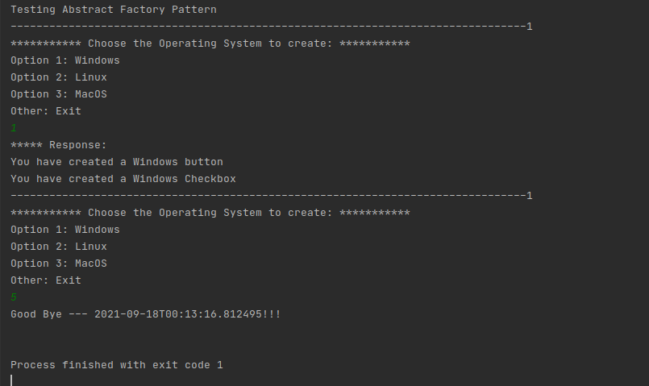

# Abstract-Factory-Pattern
- This is an example of Abstract Factory Pattern in Java

### Buttons Products Family:
- LinuxButton
- WindowsButton
- MacOSButton

### Checkboxes Products Family
- LinuxCheckbox
- WindowsCheckbox
- MacOSCheckbox

### Factories
- LinuxFactory
- WindowsFactory
- MacOSFactory

###Run Example:
